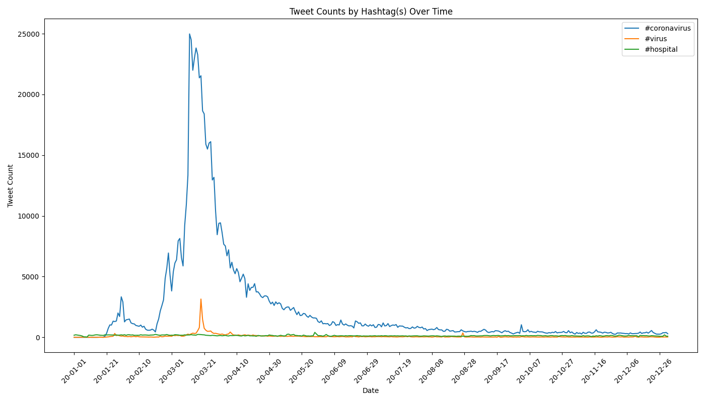

# **Tracking the Spread of COVID-19 on Twitter Using MapReduce**

## **Project Overview**
This project analyzes geotagged tweets from 2020 to track the spread of **COVID-19-related discussions** worldwide. By processing a dataset of over **1.1 billion tweets**, the project applies **MapReduce principles** to efficiently extract insights on how specific hashtags were used across different languages and countries.

## **How I Built This**

### **Step 1: Understanding the Dataset**
The dataset consists of **compressed JSON files** containing all geotagged tweets from 2020. Each day’s data is stored in a ZIP file with **24 files inside**, one for each hour of the day. To process this efficiently, I needed a **divide-and-conquer** approach—this is where **MapReduce** comes in.

### **Step 2: Writing the Mapper**
The first challenge was writing a **Python script (map.py)** to:
- **Extract relevant tweets** containing COVID-19 hashtags.
- **Count occurrences** of these hashtags based on **language** and **country**.
- **Handle missing location data**, such as tweets from international waters.

I had to debug edge cases, ensuring that missing `country_code` values didn’t break the program. Once the script was solid, I automated running it across all daily datasets.

### **Step 3: Running the Mapper in Parallel**
Since processing each day’s tweets takes a long time, I created a **shell script (`run_maps.sh`)** that:
- Loops over all Twitter dataset files.
- Runs the `map.py` script **in parallel** using `nohup` and `&` to prevent disruptions if I disconnect from the server.
- Outputs **two files per day**:  
  - A **.lang file** (tracks hashtag usage by language).  
  - A **.country file** (tracks hashtag usage by country).

### **Step 4: Aggregating the Data with Reduce**
Once the mapper finished, I wrote `reduce.py` to **merge** all `.lang` and `.country` files. This step:
- **Combines counts across all processed days**.
- **Creates a single output file** summarizing hashtag usage for the entire year.

### **Step 5: Data Visualization**
With the reduced data in place, I needed to make sense of it visually.  
I modified `visualize.py` to:
- **Sort hashtag counts** and display the **top 10** languages and countries using a bar graph.
- **Save each visualization as a PNG file** for analysis.

I later refined the script to dynamically adjust:
- The **x-axis labels** based on whether the dataset was language-based or country-based.
- The **title formatting** to match the dataset.

### **Step 6: Tracking Hashtag Trends Over Time**
I took the analysis further by writing `alternative_reduce.py`, which:
- **Plots how hashtag usage evolved daily throughout the year**.
- Uses **line charts** to track the number of tweets mentioning each hashtag.
- Handles **multiple hashtags simultaneously**, so I could compare trends like **#coronavirus** vs. **#코로나바이러스** (Korean for "coronavirus").

## **Generated Charts**

### Top 10 Countries Using #coronavirus

### Top 10 Languages Using #coronavirus

### Top 10 Countries Using #코로나바이러스

### Top 10 Languages Using #코로나바이러스

### Hashtag Trends Over Time

